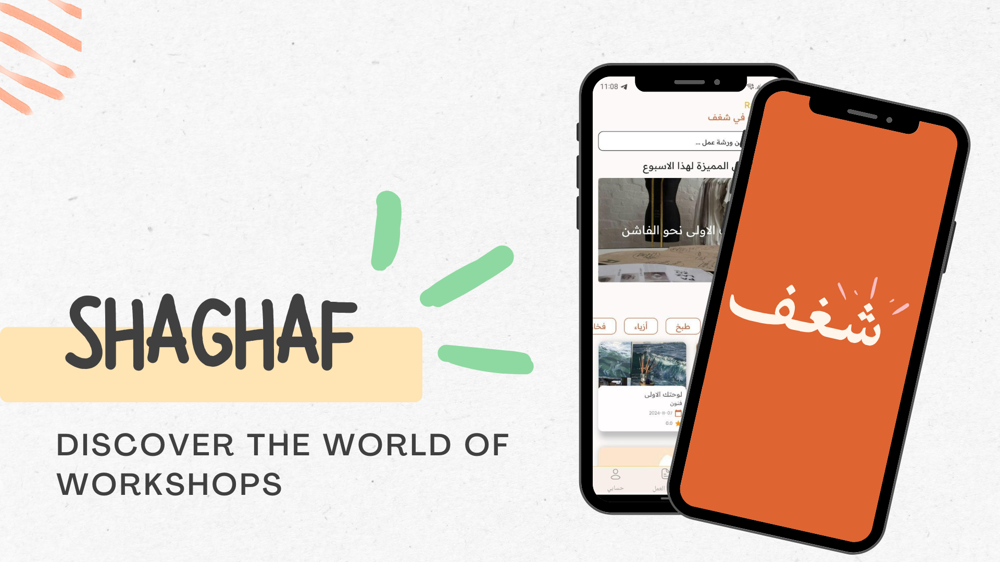
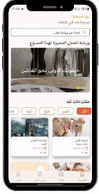
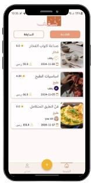
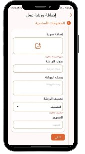
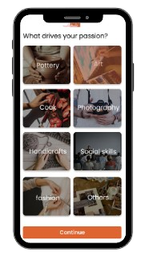

## Shaghaf : We connect you to your passion 🧡



<p align ="center">
 <a href="#problemdefinition">Problem Definition</a> •
  <a href="#goal">Goal</a> •
  <a href="#key-features">Key Features</a> •
  <a href="#how-to-use">How To Use</a> •
  <a href="#contributing">Contributing</a> •
  <a href="#output">Output</a> 
</p>


### 1. Problem Definition ⛔
In Saudi Arabia, people are always driven by their passion in art, cooking, photography, self-development, or any other field, but often struggle to find unique experiences and suitable events. Meanwhile, venues like cafes and small businesses lack a centralized platform to promote the workshops they are hosting, limiting exposure and participation.

### 2. Goal 🚀
Shaghaf is a an application that connects you to your passion and helps you develop your skills in any field you desire by providing workshops presented by talented experts in the field.

Shaghaf is useful for both participants and organizers by promoting the organizers workshops and increasing the number of participants.


### 3. Key Features 🎯
In Shaghaf, we provide a seamless user experience for participants, organizers, and admin.

key features include :

#### 3.1 Participants :
- Choose favorite categories.
- View Available workshops.
- View workshops details.
- search/filter workshops by date, price, and type.
- book a workshop.
- View booked workshops.
- rate a workshop.

#### 3.2 Organizers :
- add a workshop.
- edit a workshop.
- take attendance.

#### 3.3 Admin :
- View Dashboard
- View Statistics

#### 3.4 General :
- Multi-Language support.
- Light/Dark Mode.

### 4. Tools and Technologies 📱
- **Figma:** For creating wireframes and designing the app interface.
- **Flutter:** Used for building the cross-platform application.
- **Moyasar:** Payment gateway for in-app payment processes.
- **Supabase:** As the backend database, handling tables and functions.
- **OneSignal:** For sending push notifications.

 
### 5. How To Use 🤔
- To clone and run this application, you'll need [Git](https://git-scm.com) and [Visual Studio Code] 

```bash
# Clone this repository
$ git clone https: url

# Go into the repository
$ cd repo-name

# Open project in vs
$ code .

# Run the project 
$ dart run
```

### 6. Contributing🙇‍♂️
#### We would be happy to have your ideas to improving the project. Please feel free to do so.

```bash
# Fork the project

# Create your feature branch
$ git checkout -b branch-name

# Commit your changes
$ git commit -m 'Add some commit'

# Push to the branch
$ git push

# Open a Pull Request

```

### 7. Output






### 8. Figma file
It has been a long journey !\
Dive into its details by visiting the link
 - https://www.figma.com/design/tlR7qSjkKKMWrbuDuFZqFJ/coffee-app?node-id=0-1&t=lkJgK6SliNRboBha-1

Thank you for reading 🧡

### Team Members 
- Yaser Alkhayyat 👨🏻‍💻
- Najwa Aldahri 👩🏻‍💻
- Rahaf Alghamdi 👩🏻‍💻
- Turki Aloufi 👨🏻‍💻

**Shaghaf 2024 ©️**